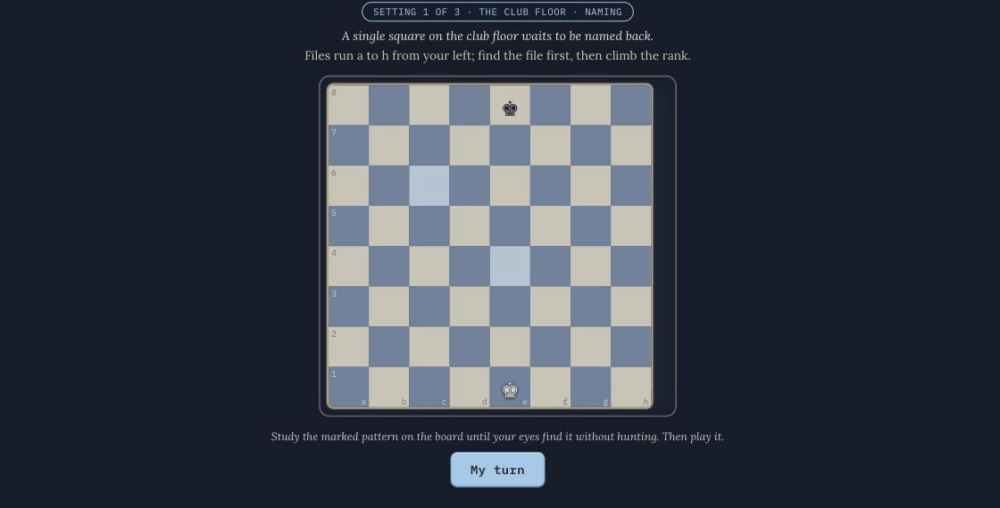

# Tempo



An interactive chess course in one React file. Live at [bmallegri.github.io/tempo](https://bmallegri.github.io/tempo/).

I built it for a complete beginner who learns through games, so it is one: notebook pages inked on a live board, club nights against the house, a cabinet of chess history, a searching engine waiting at the end. Wrong-but-legal moves don't get a red X; the board plays the refutation and you watch the punishment land.

In chess, a tempo is the smallest unit of time: a single move. Gain one and your opponent spends their turn answering you instead of playing their own game. A course should work the same way, every page putting you a move ahead.

## Stack

React 18 in one JSX file, no dependencies beyond react and react-dom; Lora and IBM Plex Mono; Vite builds it and GitHub Actions deploys to Pages.

## Run it locally

Needs Node.js 18 or newer and npm.

```bash
git clone https://github.com/bmallegri/tempo
cd tempo
npm install
npm run dev
```

Open the printed local URL (usually http://localhost:5173).

## What's inside

The Notebook: 18 concepts in four chapters, with margin notes, worked contexts, and club dues, which are real tasks to go do on lichess. Wrong-but-legal moves get refuted on the board instead of marked wrong.

Club Nights: four boss evenings, ending with the Long Game against the Automaton, a real depth-two engine.

The Midnight Salon: strategy argued as a card game across two tables. Twenty situations on real diagrams. Pick a plan, get it rated Masterstroke, Sound, or Dubious, then read the principle and the four thinking steps behind it.

The Back Table: a sandbox with take-backs, hints, and a gentle engine.

Also in here: the Cold Drill, the Cabinet (24 cards of real chess history), the Phrasebook (how the regulars actually talk), and a profile ledger with a six-axis radar.

## Saves

Progress saves to localStorage under `tempo-save`. Fresh start:

```js
localStorage.removeItem("tempo-save"); location.reload();
```

## Design notes

Design notes live in `design-history.md`: how it is put together, and why it looks the way it does.

## Layout

- `src/Tempo.jsx`: the entire game in one file: engine, content, interface.
- `src/main.jsx`: mounts it.

## Planned

Nothing on a schedule. If I come back to it: a fifth chapter on openings, and more salon tables.

## License

Code released under the [MIT License](LICENSE).
